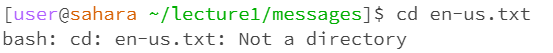
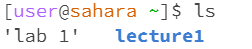
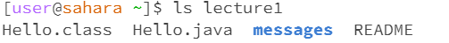
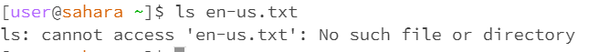

CD Command
1. Share an example of using the command with no arguments.

- The working directory is the main directory, 'lab 1'
- There was no output when using cd means change directory, and there was no directory we were heading to
- The output is not an error, there was just not enough information to give a more meaningful output
  
2. Share an example of using the command with a path to a directory as an argument.

- The working directory is lecture1
- The output changed the terminal name meaning we did successfully change the directory
- The output is not an error, because we successfully changed directories

3. Share an example of using the command with a path to a directory as an argument.

- The working directory is messages
- The output 'not a directory' occured because the file I wanted to go to was not a directory. Somehow it went to messages as the directory, likely because it is the closest
- This is an input error, because the file is not a directory. 

LS Command
1. Share an example of using the command with no arguments.

- The working directory is 'lab 1'
- LS lists the files and folders given the path. Since there was no path, the ls is in the main directory. It listed 'lab 1' because that i a directory and 'lecture1' because that is also a directory
- The output is not an error

2. Share an example of using the command with a path to a directory as an argument.

- The working directory is 'lecture1'
- LS lists the files and folders of the given path. In the lecture1 directory is Hello.class file, Hello.java file, read me, and messages folder. The messages is blue because it is a folder.
- The output is not an error

3. Share an example of using the command with a path to a file as an argument.

- There is no working directory, the working directory is the terminal or 'lab 1'
- I got the output because a file cannot contain other files within it. There are no files or directory's in the file.
- The output is an error because I did not give the right command. 

