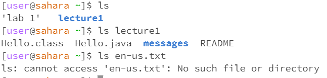

cd command
1. Share an example of using the command with no arguments.

2. Share an exmaple of using the command with a path to a directory as an argument.

3. Share an example of using the command with a path to a file as an argument.

ls command
1. Share an example of using the command with no arguments.
2. Share an exmaple of using the command with a path to a directory as an argument.
3. Share an example of using the command with a path to a file as an argument.

