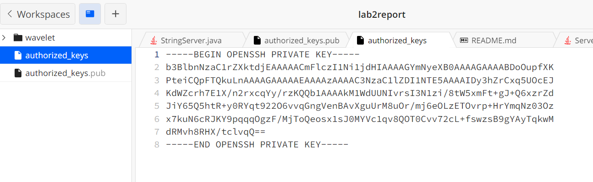

**Part 1**
**Code for StringServer:**

**1st Screenshot of /add-message**

**Which methods in your code are called?**
- getPath()
- contains()
- getQuery()
- split()
- Integer.toString(num)
  
**What are the relevant arguments to those methods, and the values of any relevant fields of the class?**
- getPath gets the url link. The contains("/add") method checks to see if the string inside is present in the url. If it is present, then the getQuery() finds the information given, then the .split("=") method splits the information into a list of two elements. We return the second element and the number using the Integer.toString(num) method.
- when /add-message?s=Hello is being sent to the URL, the method split("=") splits the message into two parts, so that we can access the message "Hello" using parameters[1]. The Integer.toString(num) method helps print out the message "1. Hello"
  
**How do the values of any relevant fields of the class change from this specific request? If no values got changed, explain why.**
- the integer variable `num` is changed with every request, and is being increased by one after every request. The string variable `statements` is also being changed and added onto with every request.
- When /add-message?s=Hello is being used, the variable `num` changes from 0 to 1. The `statement` variable is being changed from "" to "1. Hello"

**2nd Screenshot of /add-message**

**Which methods in your code are called?**
- getPath()
- contains()
- getQuery()
- split()
- Integer.toString(num)
  
**What are the relevant arguments to those methods, and the values of any relevant fields of the class?**
- `getPath` gets the url link. The contains("/add") method checks to see if the string inside is present in the url. If it is present, then the `getQuery()` finds the information given, then the `.split("=")` method splits the information into a list of two elements. We return the second element and the number using the `Integer.toString(num)` method.
- when `/add-message?s=How` are you is being sent to the URL, the method `split("=")` splits the message into two parts, so that we can access the message "How are you" using parameters[1]. The Integer.toString(num) method helps print out the num integer. The message is now
`1. Hello
2. How are you`
  
**How do the values of any relevant fields of the class change from this specific request? If no values got changed, explain why.**
- the int variable `num` is changed with every request, and is being increased by one after every request. The string variable `statements` is also being changed and added onto with every request.
- When `/add-message?s=How` are you is being used, the variable `num` changes from 1 to 2. The `statement` string is being added on to. It goes from `"1. Hello"` to `"1. Hello \n 2. How are you"`

**Part 2**
- The path to the private key for your SSH key for logging into ieng6 (on your computer or on the home directory of the lab computer)
- The path to the public key for your SSH key for logging into ieng6 (within your account on ieng6)

- A terminal interaction where you log into ieng6 with your course-specific account without being asked for a password.

**Part 3**
In a couple of sentences, describe something you learned from lab in week 2 or 3 that you didn’t know before.
- I learned where keys for a computer can be stored, I also learned how to use methods getQuery(). Another thing I learned was that mkdir means 'make new directory'
