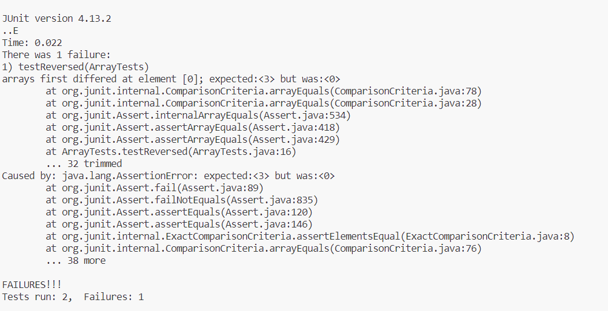

__Part 1__
- A failure-inducing input for the buggy program, as a JUnit test and any associated code (write it as a code block in Markdown)

``` java
@Test
  public void testReversed() {
    int[] input1 = {1,2,3 };
    assertArrayEquals(new int[]{ 3,2,1}, ArrayExamples.reversed(input1));
  }
```

- An input that doesn’t induce a failure, as a JUnit test and any associated code (write it as a code block in Markdown)
``` java
	@Test 
	public void testReverseInPlace() {
    int[] input1 = { 3 };
    ArrayExamples.reverseInPlace(input1);
    assertArrayEquals(new int[]{ 3 }, input1);
	}
```
- The symptom, as the output of running the tests (provide it as a screenshot of running JUnit with at least the two inputs above)


- The bug, as the before-and-after code change required to fix it (as two code blocks in Markdown)
``` java
//buggy code
  static void reverseInPlace(int[] arr) {
    for(int i = 0; i < arr.length; i += 1) {
      arr[i] = arr[arr.length - i - 1];
    }
  }
```
``` java
//fixed code
  static void reverseInPlace(int[] arr) {
    for(int i = 0; i < (arr.length/2); i ++) {
      int temp = arr[i];
      arr[i] = arr[arr.length - i - 1];
      arr[arr.length - i - 1] = temp;
    }
  }
```
``` java
//buggy coe
  static int[] reversed(int[] arr) {
    int[] newArray = new int[arr.length];
    for(int i = 0; i < arr.length; i += 1) {
      arr[i] = newArray[arr.length - i - 1];
    }
    return arr;
  }
```
``` java
    static int[] reversed(int[] arr) {
    int[] newArray = new int[arr.length];
    int index = 0;
    for(int i = arr.length-1; i > -1; i --) {
      newArray[index] = arr[i];
      index++;
    }
    return newArray;
  }
```
- Briefly describe why the fix addresses the issue.
The ` reverseInPlace(int[] arr)` returns the same array it started with instead of the reverse. 


__Part 2__
__1. Find -Size__

__Command 1__

T@DESKTOP-84E1182 MINGW64 ~/Documents/GitHub/lab3/docsearch (main) `$ find technical/plos -size +20k`

__Output 1__

`technical/plos/journal.pbio.0020053.txt
technical/plos/journal.pbio.0020054.txt
technical/plos/journal.pbio.0020113.txt
technical/plos/journal.pbio.0020161.txt
technical/plos/journal.pbio.0020267.txt
technical/plos/journal.pbio.0020347.txt
technical/plos/journal.pbio.0020406.txt
technical/plos/journal.pbio.0020439.txt
technical/plos/journal.pbio.0030137.txt
technical/plos/pmed.0010008.txt
technical/plos/pmed.0010028.txt
technical/plos/pmed.0010036.txt
technical/plos/pmed.0010045.txt
technical/plos/pmed.0010062.txt
technical/plos/pmed.0010064.txt
technical/plos/pmed.0010066.txt
technical/plos/pmed.0020015.txt
technical/plos/pmed.0020016.txt
technical/plos/pmed.0020018.txt
technical/plos/pmed.0020045.txt
technical/plos/pmed.0020050.txt
technical/plos/pmed.0020059.txt
technical/plos/pmed.0020061.txt
technical/plos/pmed.0020073.txt
technical/plos/pmed.0020103.txt
technical/plos/pmed.0020123.txt
technical/plos/pmed.0020140.txt
technical/plos/pmed.0020160.txt
technical/plos/pmed.0020162.txt`

__Explanation 1__

The `find -size` command searches for files that are more, less than, or equal the size we give. `$ find technical/plos -size +20k` in this case finds all files in `technical`'s directory `plos` that is greater than 20 kilobytes. We search greater because of the `+20k` part of the command. This is useful if we are trying locate and delete files over a certain size, or if we are trying to categorize files by size. 

__Command 2__

T@DESKTOP-84E1182 MINGW64 ~/Documents/GitHub/lab3/docsearch (main) `$ find technical/biomed -size -30k`

__Output 2__

`technical/biomed
technical/biomed/1468-6708-3-1.txt
technical/biomed/1468-6708-3-3.txt
technical/biomed/1468-6708-3-7.txt
technical/biomed/1471-2091-2-10.txt
technical/biomed/1471-2091-2-12.txt
technical/biomed/1471-2091-2-13.txt
technical/biomed/1471-2091-2-16.txt
technical/biomed/1471-2091-2-7.txt
technical/biomed/1471-2091-2-9.txt
technical/biomed/1471-2091-3-13.txt
technical/biomed/1471-2091-3-8.txt
technical/biomed/1471-2091-4-5.txt
technical/biomed/1471-2105-2-9.txt
technical/biomed/1471-2105-3-12.txt
technical/biomed/1471-2105-3-22.txt`

__Explanation 2__
The `find -size` command searches for files that are more, less than, or equal the size we give. `$ find technical/plos -size -30k` in this case finds all files in `technical`'s directory `plos` that is less than 30 kilobytes. We search less because of the `-20k` part of the command. This is useful if we are trying locate and delete files over a certain size, or if we are trying to categorize files by size. 

__2. Find -Type__

__Command 1__

T@DESKTOP-84E1182 MINGW64 ~/Documents/GitHub/lab3/docsearch (main)
`$ find technical/ -type d`

__Output 1__

`technical/
technical/911report
technical/biomed
technical/government
technical/government/About_LSC
technical/government/Alcohol_Problems
technical/government/Env_Prot_Agen
technical/government/Gen_Account_Office
technical/government/Media
technical/government/Post_Rate_Comm
technical/plos`

__Explanation 1__

The `find type` command searches for the type of item listed in the directory. In this case `find -type d` finds and lists all the directories in the directory `technical/` because the `-type d` searches and lists directories. This is relevant in case we are searching for certain subdirectories in a directory. This can also be relevant if you want to count how many subdirectories are in a directory

__Command 2__

T@DESKTOP-84E1182 MINGW64 ~/Documents/GitHub/lab3/docsearch (main)
`$ find technical/government -type f`

__Output 2__

`technical/government/About_LSC/Comments_on_semiannual.txt
technical/government/About_LSC/commission_report.txt
technical/government/About_LSC/conference_highlights.txt
technical/government/About_LSC/CONFIG_STANDARDS.txt
technical/government/About_LSC/diversity_priorities.txt
technical/government/About_LSC/LegalServCorp_v_VelazquezDissent.txt
technical/government/About_LSC/LegalServCorp_v_VelazquezOpinion.txt
technical/government/About_LSC/LegalServCorp_v_VelazquezSyllabus.txt
technical/government/About_LSC/ODonnell_et_al_v_LSCdecision.txt
technical/government/About_LSC/ONTARIO_LEGAL_AID_SERIES.txt
technical/government/About_LSC/Progress_report.txt
technical/government/About_LSC/Protocol_Regarding_Access.txt
technical/government/About_LSC/reporting_system.txt
technical/government/About_LSC/Special_report_to_congress.txt
technical/government/About_LSC/State_Planning_Report.txt
technical/government/About_LSC/State_Planning_Special_Report.txt
technical/government/About_LSC/Strategic_report.txt
technical/government/Alcohol_Problems/DraftRecom-PDF.txt
technical/government/Alcohol_Problems/Session2-PDF.txt
technical/government/Alcohol_Problems/Session3-PDF.txt
technical/government/Alcohol_Problems/Session4-PDF.txt
technical/government/Env_Prot_Agen/1-3_meth_901.txt
technical/government/Env_Prot_Agen/atx1-6.txt
technical/government/Env_Prot_Agen/bill.txt
technical/government/Env_Prot_Agen/ctf1-6.txt`

__Explanation 2__

The `find -type` command searches for the type of item listed in the directory. In this case `find -type f` finds and lists all files found in 'technical/government` because the `-type f` searches and lists files. This is relevant in case we are searching for certain files in a directory that are regular files. 

__3. Find -mtime__

__Command 1__

T@DESKTOP-84E1182 MINGW64 ~/Documents/GitHub/lab3/docsearch (main)
`$ find technical/biomed -mtime -7`

__Output 1__

`technical/biomed
technical/biomed/1468-6708-3-1.txt
technical/biomed/1468-6708-3-10.txt
technical/biomed/1468-6708-3-3.txt
technical/biomed/1468-6708-3-4.txt
technical/biomed/1468-6708-3-7.txt
technical/biomed/1471-2091-2-10.txt
technical/biomed/1471-2091-2-11.txt
technical/biomed/1471-2091-2-12.txt
technical/biomed/1471-2091-2-13.txt
technical/biomed/1471-2091-2-16.txt`

__Explanation 1__

The `find -mtime` command searches for files based on when they were last modified. In this case the `-mtime -7` part of the command searches for files that were modified in the last seven days. This is helpful if you are looking for a file you recently modified, or looking for a files you modified a certain number of days ago. 

__Command 2__

T@DESKTOP-84E1182 MINGW64 ~/Documents/GitHub/lab3/docsearch (main)
`$ find technical/biomed -mtime 0`

__Output 2__
`technical/biomed
technical/biomed/1468-6708-3-1.txt
technical/biomed/1468-6708-3-3.txt`

__Explanation 2__

The `find -mtime` command searches for files based on when they were last modified. In this case the `-mtime 0` part of the command searches for files that were modified in the last  day. This is helpful if you are looking for a file you recently modified, or looking for a files you modified a certain number of days ago. 

__4. Find -newermt__

__Command 1__

T@DESKTOP-84E1182 MINGW64 ~/Documents/GitHub/lab3/docsearch (main)
`$ find technical/government/Post_Rate_comm -newermt "2023-10-01 00:00:00"  ! -newermt "2023-11-03 00:00:00"`

__Output 1__

`technical/government/Post_Rate_comm
technical/government/Post_Rate_comm/Cohenetal_comparison.txt
technical/government/Post_Rate_comm/Cohenetal_Cost_Function.txt
technical/government/Post_Rate_comm/Cohenetal_CreamSkimming.txt
technical/government/Post_Rate_comm/Cohenetal_DeliveryCost.txt
technical/government/Post_Rate_comm/Cohenetal_RuralDelivery.txt
technical/government/Post_Rate_comm/Cohenetal_Scale.txt
technical/government/Post_Rate_comm/Gleiman_EMASpeech.txt
technical/government/Post_Rate_comm/Gleiman_gca2000.txt
technical/government/Post_Rate_comm/Mitchell_6-17-Mit.txt
technical/government/Post_Rate_comm/Mitchell_RMVancouver.txt
technical/government/Post_Rate_comm/Mitchell_spyros-first-class.txt
technical/government/Post_Rate_comm/Redacted_Study.txt
technical/government/Post_Rate_comm/ReportToCongress2002WEB.txt
technical/government/Post_Rate_comm/WolakSpeech_usps.txt`

__Explanation 1__

The `-newmt` command finds files modified before a certain date and time. This can be useful if you are looking for files between a time period. 

__Command 2__

T@DESKTOP-84E1182 MINGW64 ~/Documents/GitHub/lab3/docsearch (main)
`$ find technical/ -newermt "2023-11-2 00:00:00"`

__Output 2__

`technical/biomed
technical/biomed/1468-6708-3-1.txt
technical/biomed/1468-6708-3-3.txt`

__Explanation 2__
The `-newmt` command finds files modified before a certain date and time. In this case we are looking for files modified before 11/2/23 @12am. This can be useful if you are looking for files between a time period. 

__Sources:__
https://tecadmin.net/linux-find-command-with-examples/ 
https://askubuntu.com/questions/1452032/can-finds-newermt-accept-epoch-time 

