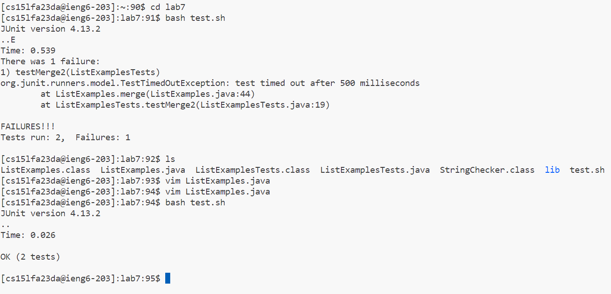

**4. Log into ieng6**

Since my login `ssh cs15lfa23da@ieng6.ucsd.edu` was already in my history, I clicked `<up>` `<up>` in my empty terminal so `ssh cs15lfa23da@ieng6.ucsd.edu` showed up

**5. Clone your fork of the repository from your Github account (using the SSH URL)**

**6. Run the tests, demonstrating that they fail**

**7. Edit the code file to fix the failing test**

Keys pressed: `<down>`, `<down>`, `<down>`, `<down>`, `<right>`, `<right>`, `<right>`, `<right>`, `<right>` doing this i got to the end of the word `index1` on the file, then I clicked `x` when hovering over the 1. I then clicked `i` to enter insert mode and then added in the number `2` to change the variable `index1` to `index2` After editing the variable, i clicked `esc` to exit from insert mode. After that, I typed `:wq` to save my edits and leave vim mode

**8. Run the tests, demonstrating that they now succeed**

To run the tests I clicked `<up>` `<up>` `<up>` `<up>` to get to `bash test.sh` because it was already in the search history, and then I clicked `<enter>`

**9. Commit and push the resulting change to your Github account (you can pick any commit message!)**

