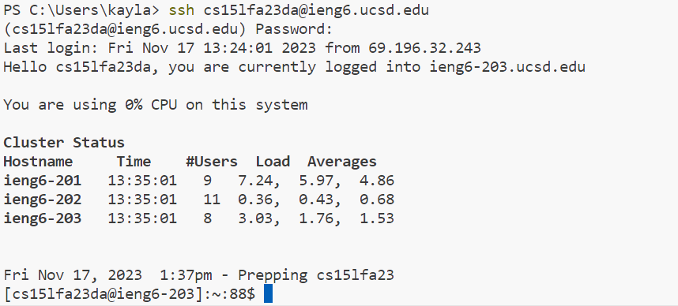
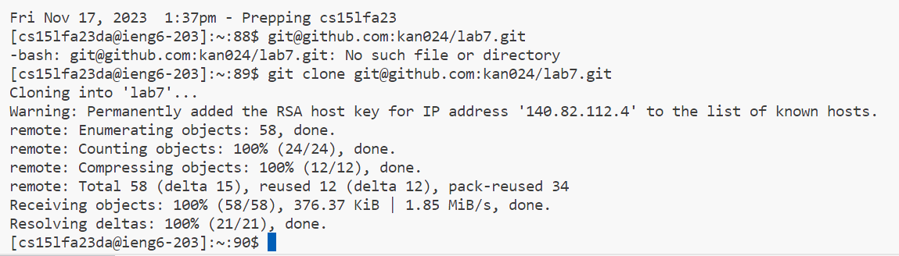
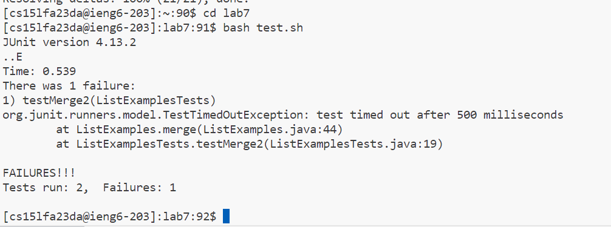
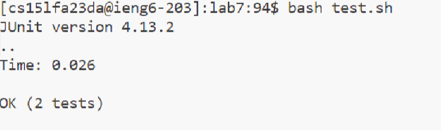
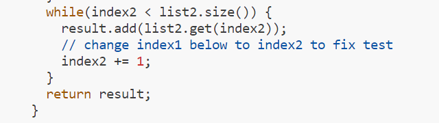
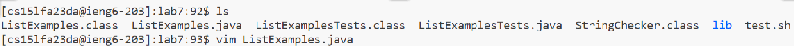
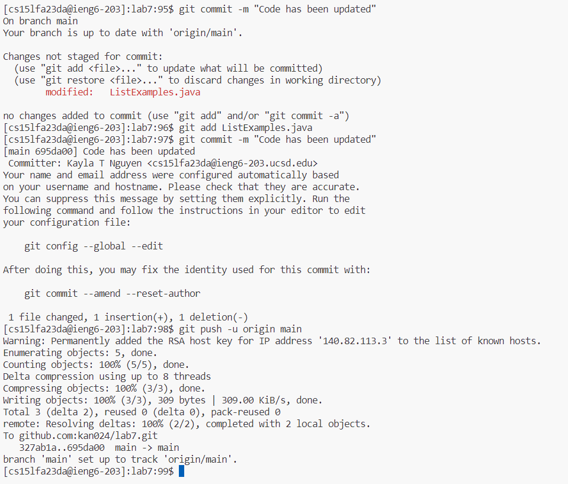
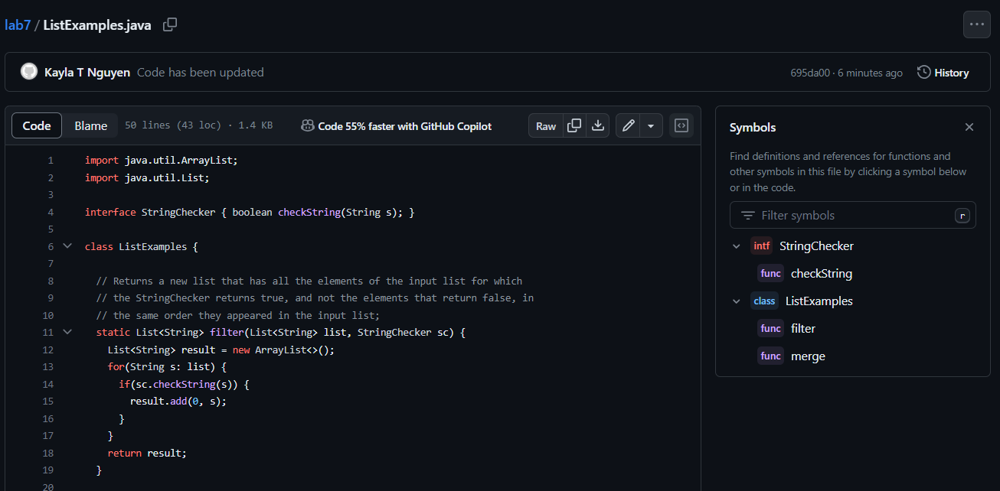
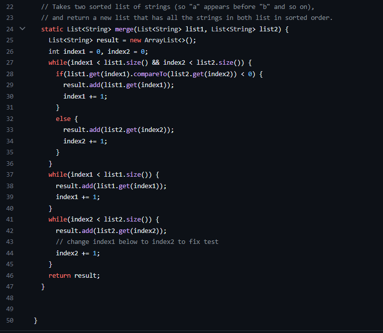

**4. Log into ieng6**

Since my login `ssh cs15lfa23da@ieng6.ucsd.edu` was already in my history, I clicked `<up>` `<up>` in my empty terminal so `ssh cs15lfa23da@ieng6.ucsd.edu` showed up in the terminal. ONce it displayed itself in the terminal, i clicked `enter` in order to log into my ssh ucsd account.

**5. Clone your fork of the repository from your Github account (using the SSH URL)**
Once I was logged into the terminal, I was prompted to type the next xommand. I had previously copied the ssh link from the github link. I right clicked on my mouse, which is the command to paste something into vs code terminal. Once it was pasted I pressed `enter`

**6. Run the tests, demonstrating that they fail**
First I typed `cd lab7` to get into the directory of `lab7`, and then i pressed `enter` to get myself into the directory. Then, once the terminal showed I was in the directory i typed `bash test.sh` and then clicked `enter` in order to run the tests. This showed the tests failed.

**7. Edit the code file to fix the failing test**

To edit the code, I did `vim ListExamples.java` then clicked `enter` in order to enter vim mode. 

First I hovered over the beginning of `index1` then I double clicked the word to highlight it. Then i clicked the `delete` key to delete the word. Next I clicked `i` to go into insert mode where i then typed `index2` after that I clicked `esc` in order to finalize the changes. After that, I typed `:wq` to save my edits and leave vim mode

**8. Run the tests, demonstrating that they now succeed**

To run the tests I clicked `<up>` `<up>` `<up>` `<up>` to get to `bash test.sh` because it was already in the search history, and then I clicked `<enter>`

**9. Commit and push the resulting change to your Github account (you can pick any commit message!)**
IN order to commit the changes, first I typed `git add ListExamples.java` and then clicked `enter`
then i typed `git commit -m "Code has been updated` and after that message was typed i clicked `enter`
then i typed `git push -u origin main` and then clicked `enter` to run the command. This allowed the changes to be pushed to the github repository. The changes I made while working on the ListExamples.java file were then seen in the github file link seen by using the browser.

